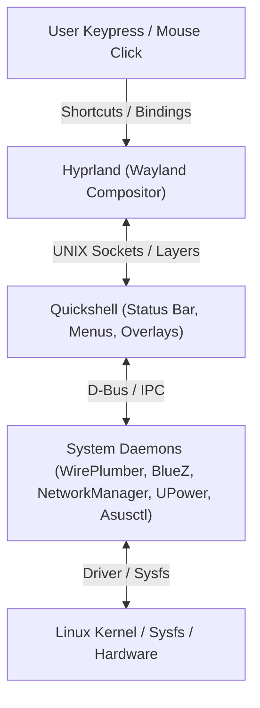

# omarchy-fixes

A centralized repository of root-cause diagnostics, self-healing wrappers, and automated recovery fixes for state desynchronization issues across [Omarchy](https://omarchy.org/) (Hyprland, Quickshell, Wayland, and Linux system daemons).


---

## Architecture: Why Desyncs Occur

Omarchy ties together multiple independent layers:



Because Quickshell manages reactive UI states while Hyprland manages physical layer surfaces and the Linux kernel manages hardware devices, an event dropped over a socket, a cold-start race condition, or an unhandled focus loss can cause the visual status to diverge from reality.

---

## Quick Reference Index of Fixes

| ID | Issue / Subsystem | Symptoms | Quick Recovery Command | Guide Link |
|---|---|---|---|---|
| **01** | **Quickshell Menu & Shortcut** | `SUPER + SPACE` unreactive or dead on first keystroke | `omarchy-menu close && omarchy-menu summon` | [Fix 01](fixes/01-menu-quickshell-desync.md) |
| **02** | **Night Light (`hyprsunset`)** | Bar indicator doesn't match screen color temperature | `omarchy toggle nightlight` | [Fix 02](fixes/02-nightlight-hyprsunset-desync.md) |
| **03** | **Workspaces & Monitors** | Wrong workspace dot highlighted after display hotplug | `omarchy restart shell` | [Fix 03](fixes/03-workspaces-hyprland-ipc.md) |
| **04** | **System Theming** | Half-themed system; apps don't change color palette | `omarchy refresh theme` | [Fix 04](fixes/04-theme-system-desync.md) |
| **05** | **Idle & Stay-Awake** | Screen won't sleep or sleeps during presentation | `omarchy toggle idle` | [Fix 05](fixes/05-idle-screensaver-lock-desync.md) |
| **06** | **Audio & WirePlumber** | Mute or volume out of sync with hardware DAC/headset | `wpctl set-mute @DEFAULT_AUDIO_SINK@ toggle` | [Fix 06](fixes/06-audio-wireplumber-desync.md) |
| **07** | **ASUS ROG Profiles** | 80% charge limit or fan profiles reset after unplug | `asus-battery-toggle` | [Fix 07](fixes/07-asus-rog-hardware-profiles.md) |
| **08** | **Global Laptop Power Profile** | Universal laptop battery optimization (Intel/AMD, ASPM, EPP, C-states) | `omarchy-power-profile` | [Fix 08](fixes/08-laptop-power-saving-pd-charging.md) |
| **09** | **ASUS Flow X13 Device Profile** | Hardware-specific tuning (Cezanne ABM, ALC294 PM, 100W PD EC throttling) | `omarchy-hyprland-refresh-rate` | [Fix 09](fixes/09-asus-flow-x13-device-profile.md) |
| **10** | **Performance & Build Speed** | Multi-threaded builds (`-j16`), pacman parallel, Kyber NVMe I/O, VA-API | `cat /sys/block/nvme0n1/queue/scheduler` | [Fix 10](fixes/10-desktop-responsiveness-build-speed.md) |

---

## Included Tools

### 1. Diagnostic Audit Tool
Run the comprehensive diagnostic check at any time to inspect your system's active sync status:

```bash
./scripts/diagnose-omarchy-sync.sh
```

Checks:
- Quickshell menu layer visibility vs IPC responsiveness
- Autostart startup hooks
- `hyprsunset` process and active color temperature
- Stay-awake inhibitor state files
- Audio sink WirePlumber defaults
- Battery charge control end thresholds

### 2. Self-Healing Menu Wrapper
The repository includes a transparent wrapper (`scripts/omarchy-menu-wrapper.sh`) placed in `~/.local/bin/omarchy-menu`:
- Intercepts menu toggle calls.
- Inspects `hyprctl layers` to verify whether the menu surface actually appeared.
- If a desync is detected, sends a desktop notification with a manual reset button AND auto-recovers the menu instantly.

### 3. Automated One-Command Installer
To install the self-healing tools and autostart synchronization hooks:

```bash
./scripts/install.sh
```

---

## License

MIT License. See [LICENSE](LICENSE) for details.
